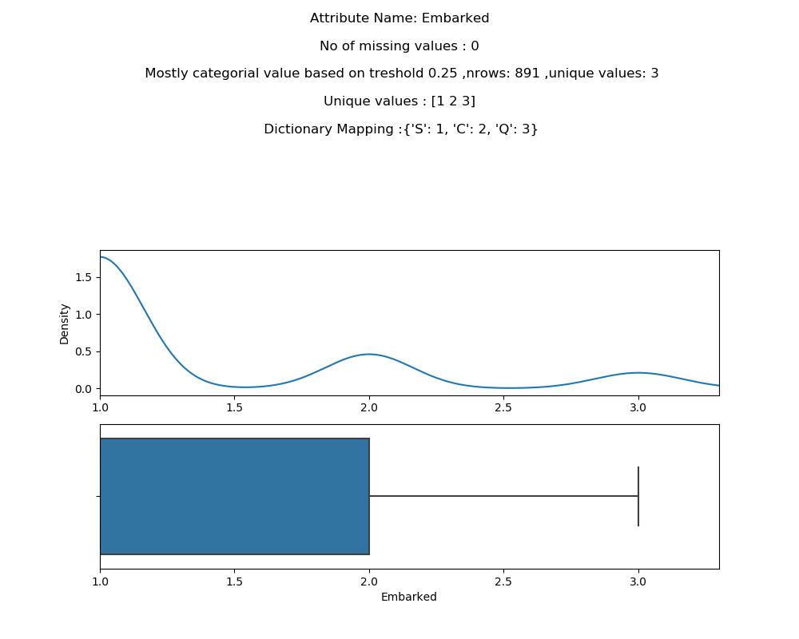

# Exploratory Data Analysis with Python

Repo provides various exploratory analysis on the dataset to get insight on data. As an example, I have taken the Titanic dataset from Kaggle ( [Titanic DataSet] )

The code is generalized for other dataset also. You can use the script for other dataset with minimal changes.

## Usage

    python code/ExploratoryDataAnalysis.py datasetName train_file targetAttribute outDirectory
    
    datasetName: Name of the dataset.
    train_file: Path of the Test data
    targetAttribute: Target Attribute
    outDirectory: directory where the reports and plot images generated

    Example: 
    python code/ExploratoryDataAnalysis.py Titanic /opt/ML/titan/train.csv Survived /opt/Exploratory-Data-Analysis-with-python/output
    
    

## Output Generated

Sample output is uploaded to *output* folder. 

1) 

Provides an overview of No# of Attributes, Name of the Attributes, Type of Attribute, Mean/Max/Range for each Attributes, Attributes with no# of missing values, Possible categorial Attributes, Unique value for these categorial values etc.

    Instance Count :  891
    Attribute count (X,y) :  12
    Attribute Names (X,y) :  ['PassengerId', 'Survived', 'Pclass', 'Name', 'Sex', 'Age', 'SibSp', 'Parch', 'Ticket', 'Fare', 'Cabin',   'Embarked']

    Most likely cataegorial values : ['Survived', 'Pclass', 'Sex', 'Age', 'SibSp', 'Parch', 'Embarked']
    Most likely **Non cataegorial values : ['PassengerId', 'Name', 'Ticket', 'Fare', 'Cabin']
    
    Sum of Missing Values for each attributes : 
        PassengerId      0
        Age            177
        Cabin          687
        Embarked         2

    Unique values for cataegorial column :  Survived [0 1]
    Unique values for cataegorial column :  Pclass [3 1 2]

Solarized dark             |  Solarized Ocean
:-------------------------:|:-------------------------:
  |  

## Author

**Nisanth Simon** - [NisanthSimon@LinkedIn]

[NisanthSimon@LinkedIn]: https://au.linkedin.com/in/nisanth-simon-03b2149
[Titanic DataSet]: https://www.kaggle.com/c/titanic/data 
