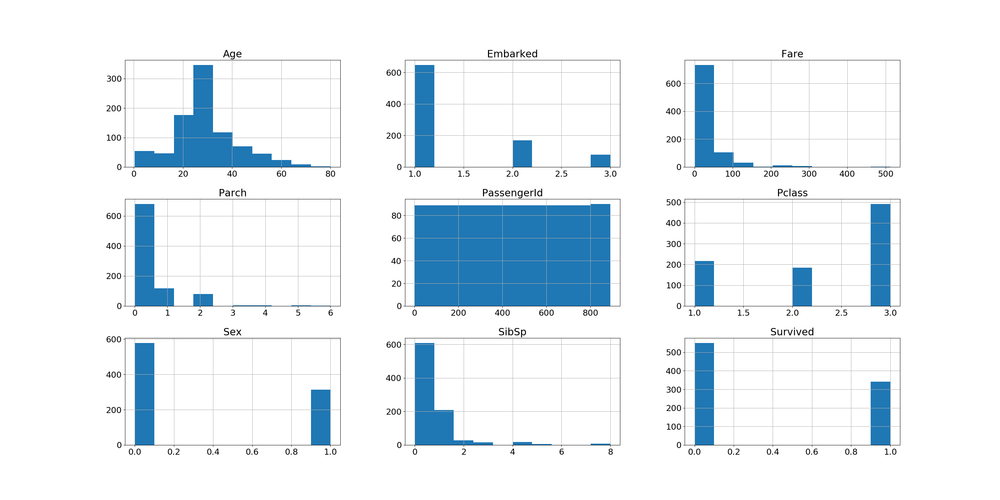

# Exploratory Data Analysis with Python

Repo provides various exploratory analysis on the dataset to get insight on data. As an example, I have taken the Titanic dataset from Kaggle ( [Titanic DataSet] )

The code is generalized for other dataset also. You can use the script for other dataset with minimal changes.

## Usage

    python code/ExploratoryDataAnalysis.py datasetName train_file targetAttribute outDirectory
    
    datasetName: Name of the dataset.
    train_file: Path of the Test data
    targetAttribute: Target Attribute
    outDirectory: directory where the reports and plot images generated

    Example: 
    python code/ExploratoryDataAnalysis.py Titanic /opt/ML/titan/train.csv Survived /opt/Exploratory-Data-Analysis-with-python/output
    
    

## Output Generated

Sample output is uploaded to *output* folder. 

**1)** 

Provides an overview of No# of Attributes, Name of the Attributes, Type of Attribute, Mean/Max/Range for each Attributes, Attributes with no# of missing values, Possible categorial Attributes, Unique value for these categorial values etc.

    Instance Count :  891
    Attribute count (X,y) :  12
    Attribute Names (X,y) :  ['PassengerId', 'Survived', 'Pclass', 'Name', 'Sex', 'Age', 'SibSp', 'Parch', 'Ticket', 'Fare', 'Cabin',   'Embarked']

    Most likely cataegorial values : ['Survived', 'Pclass', 'Sex', 'Age', 'SibSp', 'Parch', 'Embarked']
    Most likely **Non cataegorial values : ['PassengerId', 'Name', 'Ticket', 'Fare', 'Cabin']
    
    Sum of Missing Values for each attributes : 
        PassengerId      0
        Age            177
        Cabin          687
        Embarked         2

    Unique values for cataegorial column :  Survived [0 1]
    Unique values for cataegorial column :  Pclass [3 1 2]

 

**2)** Histogram and Box ploting of all attributes in a single image to get the overall view of data

Histogram plotting of all Attributes             |  Box plotting of all Attributes
:-------------------------:|:-------------------------:
  |  

 

**3)** Ploting the Density and box plot with various additional information on catagorial attributes

Plotting of Attributes - Age             |  Plotting of Attributes - Fare
:-------------------------:|:-------------------------:
  |  

You can refer the ploting for other catagorial attributes under **output/4_*_density_box_plot.png**

 

**4)** Ploting the Categorial Attributes grouped by Target Attribute

Plotting of Age grouped by Survived             |  Plotting of Pclass grouped by Survived
:-------------------------:|:-------------------------:
  |  

You can refer the ploting for other catagorial attributes under **output/5_*_GroupBy_Survived_Histogram_plot.png**

 

**5)** Pairwise plotting of Attribute

Pairwise plotting of Attributes  |           
:-------------------------:|
  

 

**6)** Ploting the Attributes by generalized values

Ploting Age_group             |  Plotting Cabin_group |  Plotting Fare_group
:-------------------------:|:-------------------------:|:-------------------------:
  |   |     

 

**6)** Ploting generalized Attributes with respect to Target attribute

Ploting Age_group with Survived            |  Plotting Cabin_group with Survived |  Plotting Fare_group with Survived
:-------------------------:|:-------------------------:|:-------------------------:
  |   |     

 

**7)** 

The file records provides the count of each attribute with respect to Target attribute.

    Group by on Attribute : Sex
    Dictionary Mapping : {'male': 0, 'female': 1}
        Sex  count  Survived
        0    0    468         0
        1    0    109         1
        2    1     81         0
        3    1    233         1
        
    Group by on Attribute : Age_group
    Age_group  count  Survived
        0       0-10     26         0
        1       0-10     38         1
        2      10-20     71         0
        3      10-20     44         1
        4      20-30    271         0
        5      20-30    136         1
        6      30-40     86         0
        7      30-40     69         1
        8      40-50     53         0
        9      40-50     33         1
        10     50-60     25         0
        11     50-60     17         1
        12     60-70     13         0
        13     60-70      4         1
        14     70-80      4         0
        15     70-80      1         1
        
 

## Author

**Nisanth Simon** - [NisanthSimon@LinkedIn]

[NisanthSimon@LinkedIn]: https://au.linkedin.com/in/nisanth-simon-03b2149
[Titanic DataSet]: https://www.kaggle.com/c/titanic/data 
